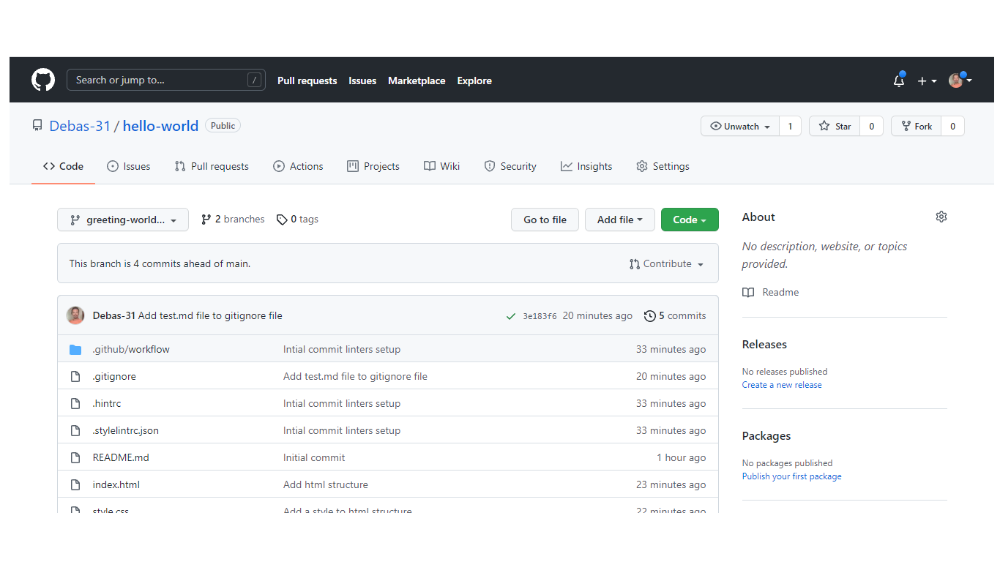

# Set up a "Hello Microverse" project

>This project demonstrated by saying hello how to use the concept of version control, Gitflow, pull request, and linters setup.

### Built With

- HTML5
- CSS3

### Live Demo

[Visit the Live Demo](https://debas-31.github.io/hello-world/)

### Install

To get a local copy up and running follow these simple example steps.
- Open terminal
- Clone this project by the command `git clone URL/repository_name.git`
- `cd repository_name` folder
- Open `index.html` in your local browser or using Live Server in Visual Studio Code.
### Authors

👤 **Debas Gebreslasie**

- [GitHub](https://github.com/Debas-31)
- [Twitter](https://twitter.com/DEBSH76956492)
- [LinkedIn](https://www.linkedin.com/in/debas-gebrengus)

### 🤝 Contributing

Contributions, issues, and feature requests are welcome!

Feel free to check the [issues page](https://github.com/Debas-31/hello-world/issues).

### Show your support

Give a ⭐️ if you like this project!

### Acknowledgments
- Microverse